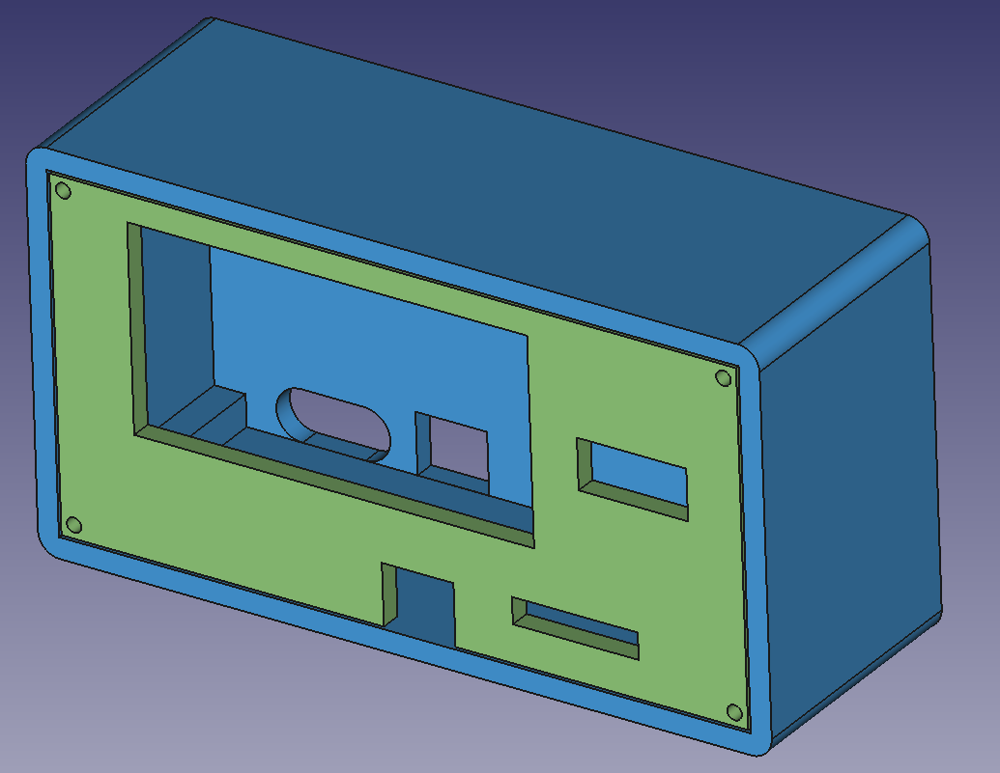

# FreeCad-PowerSupplyEnclosure
FreeCAD model for my power supply enclosure.

Can't remember where I got the power supply module from.  Cutouts are as follows:

Rear:
  - Slot for USB-C PD module
  - Slot for barrel female connector

Front:
  - (top left) Slot for power supply
  - (top right) Slot for USB (out)
  - (bottom left) Slot for barrel female connector (out)
  - (bottom right) Slot for banana plug socket (out)

